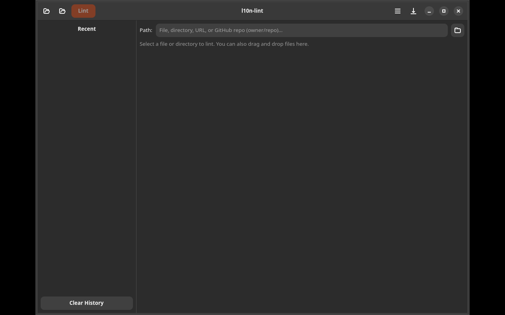

# l10n-lint

Lint and validate translation files (`.po`, `.ts`, `.xliff`) — CLI and GTK4/Adwaita interfaces.



## Features

- Missing translations, fuzzy entries, placeholder mismatches
- Typography checks: punctuation, capitalization, whitespace, quotes
- HTML tag and escape sequence validation
- Keyboard accelerator and numeric mismatch detection
- Quality checks: untranslated words, repeated words, suspicious length
- GTK4/Adwaita GUI with drag & drop, filtering, and report export
- CLI with JSON/GitHub Actions output formats
- GitHub repo scanning without cloning
- Localized output in 45+ languages

## Installation

### Debian/Ubuntu

```bash
# Add repository
curl -fsSL https://yeager.github.io/debian-repo/KEY.gpg | sudo gpg --dearmor -o /usr/share/keyrings/yeager-archive-keyring.gpg
echo "deb [signed-by=/usr/share/keyrings/yeager-archive-keyring.gpg] https://yeager.github.io/debian-repo stable main" | sudo tee /etc/apt/sources.list.d/yeager.list
sudo apt update
sudo apt install l10n-lint-gtk
```

### Fedora/RHEL

```bash
sudo dnf config-manager --add-repo https://yeager.github.io/rpm-repo/yeager.repo
sudo dnf install l10n-lint
```

### From source

```bash
pip install .
l10n-lint
```

## 🌍 Contributing Translations

Help translate this app into your language! All translations are managed via Transifex.

**→ [Translate on Transifex](https://app.transifex.com/danielnylander/l10n-lint/)**

### How to contribute:
1. Visit the [Transifex project page](https://app.transifex.com/danielnylander/l10n-lint/)
2. Create a free account (or log in)
3. Select your language and start translating

### Currently supported languages:
Arabic, Czech, Danish, German, Spanish, Finnish, French, Italian, Japanese, Korean, Norwegian Bokmål, Dutch, Polish, Brazilian Portuguese, Russian, Swedish, Ukrainian, Chinese (Simplified)

### Notes:
- Please do **not** submit pull requests with .po file changes — they are synced automatically from Transifex
- Source strings are pushed to Transifex daily via GitHub Actions
- Translations are pulled back and included in releases

New language? Open an [issue](https://github.com/yeager/l10n-lint/issues) and we'll add it!

## License

GPL-3.0-or-later — Daniel Nylander <daniel@danielnylander.se>
